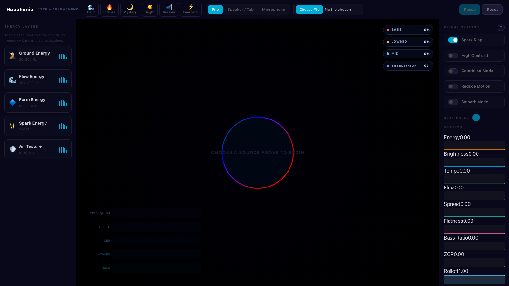
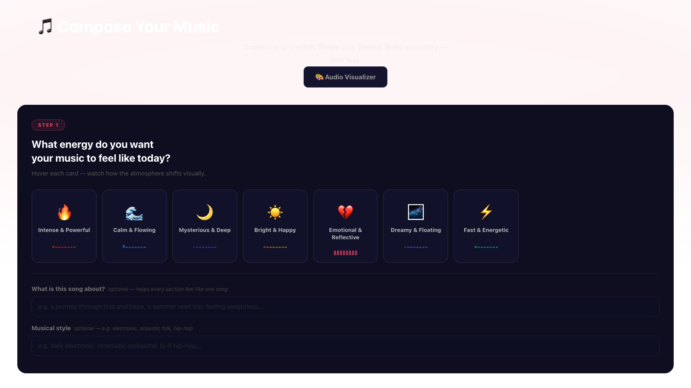
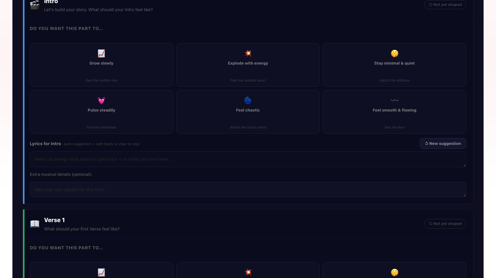
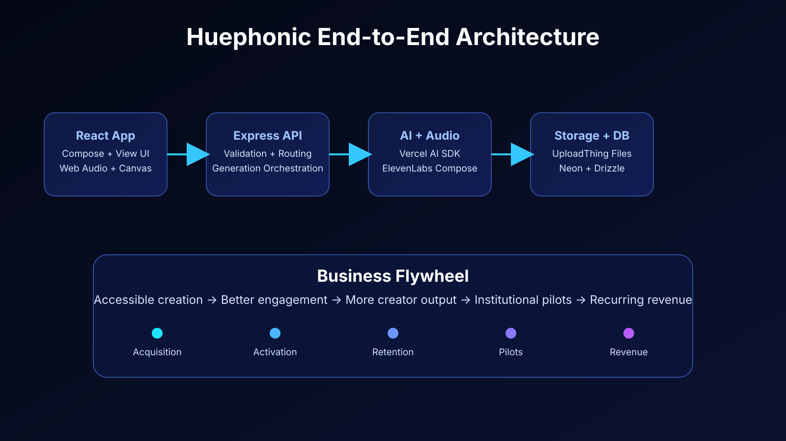
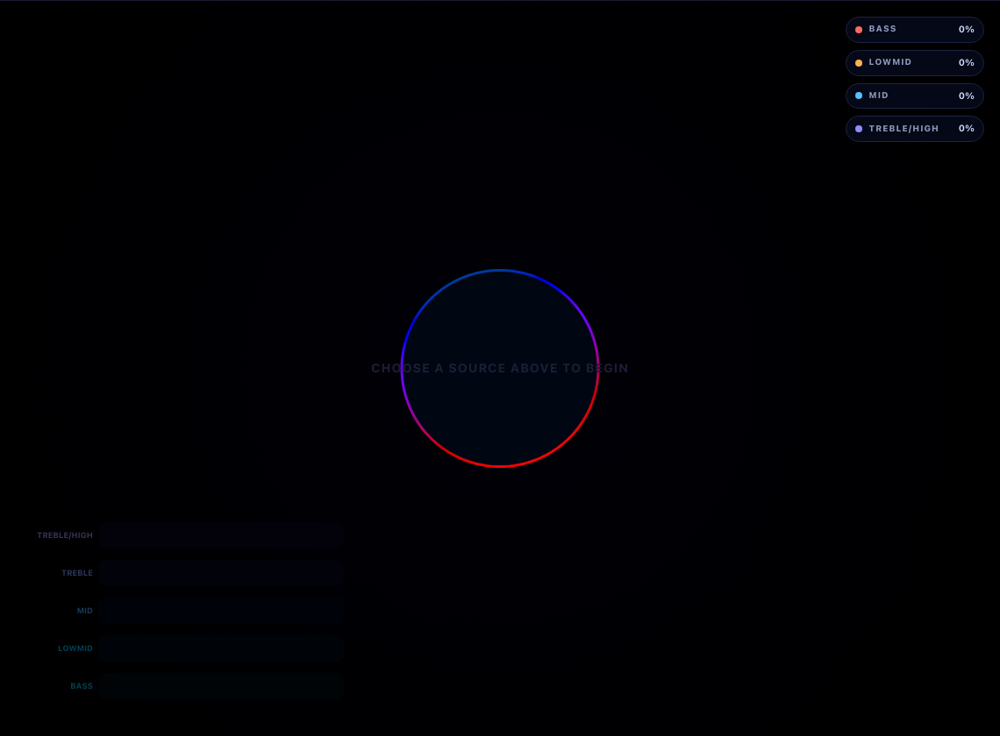
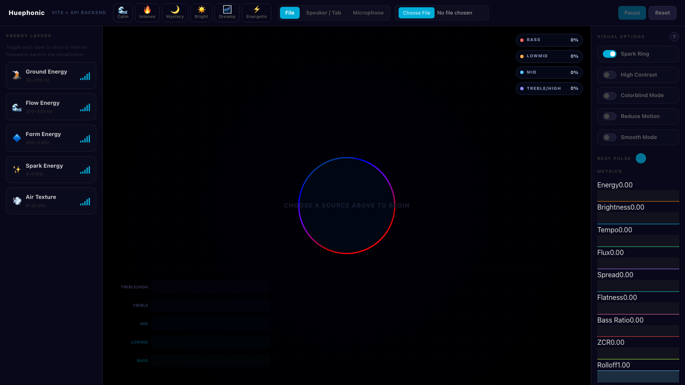
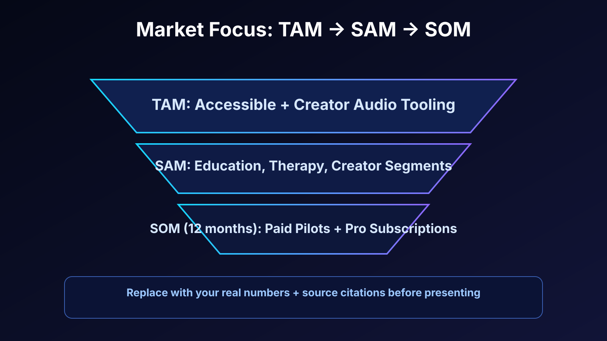

# Huephonic
## Business Pitch Deck (Judge Version)

  
<strong>We turn music into a visual language and simplify music creation-to-interpretation in one product.</strong>

  
Pre-launch pitch: product depth + market direction (without fabricated metrics).

---

## The Problem Worth Solving

- Deaf and hard-of-hearing audiences are underserved by emotionally rich music interfaces.
- Existing visualizers are mostly decorative, not interpretable.
- Creators and educators need faster, coherent music ideation workflows.

  This is both an accessibility problem and a workflow/productivity problem.

---

## Product Wedge

- **Compose page**: guided section-by-section prompt flow.
- **View page**: real-time audio analysis and reactive visuals.
- Product loop: <code>Describe -> Generate -> Play -> Visualize -> Iterate</code>

  Differentiator: one integrated workflow instead of disconnected tools.

---

## Pipeline: Prompt -> Music File

1. User provides mood/style/section inputs.
2. Backend creates structured section prompts.
3. **ElevenLabs** generates audio from prompt/composition plan.
4. **UploadThing** stores audio and returns file key/url.
5. **Neon + Drizzle** store track metadata.
6. API returns track ID for playback and visualization.

  This is a real implementation pipeline, not a mock.

---

## Next Page: `/view` DSP Visualization

- Open <code>#/view?id=...</code> to play generated music.
- We use a <strong>4-band DSP filter</strong>:
  - bass (20-200 Hz)
  - low-mid (200-800 Hz)
  - mid (800 Hz-3 kHz)
  - treble/high (3-20 kHz)
- Low-latency DSP envelope filtering stabilizes response.
- Visual latency profile:
  - file/mic response: ~80-170 ms (median)
  - tab/screen-capture response: ~180-400 ms (median, higher variance)
- Separate sine-wave layers are driven by each band (no center orb dependency).

  Visual mapping is feature-grounded, not random animation.

---

## Latency Benchmark + Limitations

- **Benchmark method (internal):**
  - inject a sharp transient (click/clap), then measure delta to first visible peak
  - 20 trials per input mode, report median + p95
- **Current benchmark envelope (early internal estimate):**
  - file/mic response (median): ~80-170 ms
  - tab/screen-capture response (median): ~180-400 ms
- **Why lag happens:**
  - FFT windowing + smoothing
  - browser/OS buffering in screen audio capture
  - render cadence (~16 ms at 60 FPS)
- **Current limitation:**
  - screen/tab capture can feel less beat-locked than direct file/mic input
  - latency spread is wider for capture mode than file/mic

  Tradeoff today: stable visuals first, ultra-low latency second.

---

## Latency Improvement Options

1. Add explicit low-latency mode (smaller FFT, lower smoothing)
2. Move band extraction to AudioWorklet with smaller frame blocks
3. Add per-input calibration offset for sync correction
4. Decouple heavy metrics from every render frame

  This gives a clear technical roadmap from “good” to “broadcast-grade” responsiveness.

---

## Why It Is Marketable

- Clear value in two categories:
  - accessibility experience
  - creator workflow utility
- Fast demoability makes it strong for content sharing and adoption.
- Works across education, therapy, creators, and live visual performance contexts.

---

## Business Model (No Public Metrics Yet)

  
<strong>Creator Pro</strong>: advanced generation, presets, export/share features

  
<strong>Institutional</strong>: education and accessibility programs

  
<strong>Platform Later</strong>: partner/API integrations

  Pre-launch stage: focus is pilot conversion and product validation, not vanity numbers.

---

## Go-To-Market (Simplified)

1. Launch creator-facing demos and short content loops.
2. Start pilot conversations with education/accessibility groups.
3. Convert pilots into repeat institutional usage.

  Distribution strategy: product-led top funnel + partnership-led conversion.

---

## Team and Why Us

- `[Name]` - `[role]` - `[domain credibility]`
- `[Name]` - `[role]` - `[technical delivery strength]`
- `[Name]` - `[role]` - `[go-to-market/ops strength]`

  Emphasize founder-market fit, shipping speed, and pilot execution ability.

---

## The Ask

1. Pilot introductions in accessibility, education, and creator networks
2. Strategic guidance on pricing and channel partnerships
3. Funding/prize support to accelerate pilot execution

  
<strong>Near-term goal</strong>: turn technical readiness into real pilot usage and conversion.

---

## Closing

# Huephonic
### Music should be experienced by everyone, not just heard.

Contact: `[email]` | `[website]` | `[github]`

